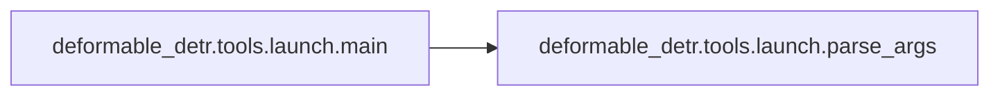

# Deformable Detr Tools Launch

[_Documentation generated by Documatic_](https://www.documatic.com)

<!---Documatic-section-Codebase Structure-start--->
## Codebase Structure

<!---Documatic-block-system_architecture-start--->
```mermaid
None
```
<!---Documatic-block-system_architecture-end--->

# #
<!---Documatic-section-Codebase Structure-end--->

<!---Documatic-section-deformable_detr.tools.launch.parse_args-start--->
## deformable_detr.tools.launch.parse_args

<!---Documatic-section-parse_args-start--->
<!---Documatic-block-deformable_detr.tools.launch.parse_args-start--->
<details>
	<summary><code>deformable_detr.tools.launch.parse_args</code> code snippet</summary>

```python
def parse_args():
    parser = ArgumentParser(description='PyTorch distributed training launch helper utilty that will spawn up multiple distributed processes')
    parser.add_argument('--nnodes', type=int, default=1, help='The number of nodes to use for distributed training')
    parser.add_argument('--node_rank', type=int, default=0, help='The rank of the node for multi-node distributed training')
    parser.add_argument('--nproc_per_node', type=int, default=1, help='The number of processes to launch on each node, for GPU training, this is recommended to be set to the number of GPUs in your system so that each process can be bound to a single GPU.')
    parser.add_argument('--master_addr', default='127.0.0.1', type=str, help="Master node (rank 0)'s address, should be either the IP address or the hostname of node 0, for single node multi-proc training, the --master_addr can simply be 127.0.0.1")
    parser.add_argument('--master_port', default=29500, type=int, help="Master node (rank 0)'s free port that needs to be used for communciation during distributed training")
    parser.add_argument('training_script', type=str, help='The full path to the single GPU training program/script to be launched in parallel, followed by all the arguments for the training script')
    parser.add_argument('training_script_args', nargs=REMAINDER)
    return parser.parse_args()
```
</details>
<!---Documatic-block-deformable_detr.tools.launch.parse_args-end--->
<!---Documatic-section-parse_args-end--->

# #
<!---Documatic-section-deformable_detr.tools.launch.parse_args-end--->

<!---Documatic-section-deformable_detr.tools.launch.main-start--->
## deformable_detr.tools.launch.main

<!---Documatic-section-main-start--->


### Object Calls

* deformable_detr.tools.launch.parse_args

<!---Documatic-block-deformable_detr.tools.launch.main-start--->
<details>
	<summary><code>deformable_detr.tools.launch.main</code> code snippet</summary>

```python
def main():
    args = parse_args()
    dist_world_size = args.nproc_per_node * args.nnodes
    current_env = os.environ.copy()
    current_env['MASTER_ADDR'] = args.master_addr
    current_env['MASTER_PORT'] = str(args.master_port)
    current_env['WORLD_SIZE'] = str(dist_world_size)
    processes = []
    for local_rank in range(0, args.nproc_per_node):
        dist_rank = args.nproc_per_node * args.node_rank + local_rank
        current_env['RANK'] = str(dist_rank)
        current_env['LOCAL_RANK'] = str(local_rank)
        cmd = [args.training_script] + args.training_script_args
        process = subprocess.Popen(cmd, env=current_env)
        processes.append(process)
    for process in processes:
        process.wait()
        if process.returncode != 0:
            raise subprocess.CalledProcessError(returncode=process.returncode, cmd=process.args)
```
</details>
<!---Documatic-block-deformable_detr.tools.launch.main-end--->
<!---Documatic-section-main-end--->

# #
<!---Documatic-section-deformable_detr.tools.launch.main-end--->

[_Documentation generated by Documatic_](https://www.documatic.com)